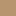
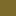

# 🔀 Color Mix Projections

This document shows *virtual* 50/50 mix results projected onto the closest existing palette color.

## 📊 Summary

- Palette size: **45 colors**
- Total mix combinations: **65**
- Average ΔE (CIEDE2000): **6.23**
- Worst-case ΔE: **13.26**

## 🚨 Largest Deviations

| Mix | Projected To | ΔE |
|----|-------------|----|
|  White +  Magenta |  Pink | 13.26 |
|  Gray +  Light Gray |  Cactus | 13.12 |
|  Black +  Brown |  Very Coffee | 11.81 |
|  White +  Light Gray |  White | 11.62 |
|  Blue +  Brown |  Berry Jam | 10.85 |
|  White +  Lime |  Celery | 10.40 |
|  Pink +  Lime |  Fizzy Peach | 9.70 |
|  Gray +  Cyan |  Atlantis | 9.18 |
|  Gray +  Brown |  Coffee | 9.01 |
|  Black +  Cyan |  Atlantis | 8.82 |

## 🎯 Projection Targets

###  Loch Ness

| Mix | ΔE |
|-----|----|
|  Magenta +  Cyan | 4.77 |
|  Purple +  Cyan | 5.70 |
|  Blue +  Light Gray | 6.91 |
|  Light Blue +  Magenta | 6.94 |

###  Ginger Dough

| Mix | ΔE |
|-----|----|
|  Red +  Lime | 3.94 |
|  Orange +  Brown | 4.41 |
|  Green +  Magenta | 4.76 |
|  Light Gray +  Brown | 8.55 |

###  Pizza

| Mix | ΔE |
|-----|----|
|  Yellow +  Brown | 3.25 |
|  Orange +  Light Gray | 4.14 |
|  Lime +  Magenta | 6.21 |

###  Jungle Jewels

| Mix | ΔE |
|-----|----|
|  Lime +  Cyan | 5.35 |
|  Blue +  Lime | 6.43 |
|  Green +  Cyan | 7.61 |

###  Mauve It

| Mix | ΔE |
|-----|----|
|  Magenta +  Brown | 3.50 |
|  Red +  Magenta | 3.98 |
|  Red +  Light Gray | 6.10 |

###  Cactus

| Mix | ΔE |
|-----|----|
|  Cyan +  Brown | 3.00 |
|  Light Blue +  Brown | 6.75 |
|  Gray +  Light Gray | 13.12 |

###  Celery

| Mix | ΔE |
|-----|----|
|  Yellow +  Lime | 5.28 |
|  White +  Lime | 10.40 |

###  Fluorescence

| Mix | ΔE |
|-----|----|
|  Yellow +  Cyan | 4.36 |
|  Light Blue +  Lime | 5.27 |

###  Purple

| Mix | ΔE |
|-----|----|
|  Blue +  Magenta | 4.20 |
|  Purple +  Magenta | 7.07 |

###  Indian Silk

| Mix | ΔE |
|-----|----|
|  Purple +  Brown | 2.90 |
|  Red +  Cyan | 7.08 |

###  Atlantis

| Mix | ΔE |
|-----|----|
|  Black +  Cyan | 8.82 |
|  Gray +  Cyan | 9.18 |

###  Light Blue

| Mix | ΔE |
|-----|----|
|  Light Blue +  Cyan | 7.50 |
|  Light Blue +  Light Gray | 8.16 |

###  White

| Mix | ΔE |
|-----|----|
|  White +  Light Gray | 11.62 |

###  Pink

| Mix | ΔE |
|-----|----|
|  White +  Magenta | 13.26 |

###  Over the Sky

| Mix | ΔE |
|-----|----|
|  White +  Cyan | 7.45 |

###  Caramel Gold

| Mix | ΔE |
|-----|----|
|  White +  Brown | 6.40 |

###  Zoodles

| Mix | ΔE |
|-----|----|
|  Yellow +  Light Gray | 2.45 |

###  Butterum

| Mix | ΔE |
|-----|----|
|  Yellow +  Magenta | 7.51 |

###  Muted Blue

| Mix | ΔE |
|-----|----|
|  Blue +  Cyan | 1.73 |

###  Berry Jam

| Mix | ΔE |
|-----|----|
|  Blue +  Brown | 10.85 |

###  Red

| Mix | ΔE |
|-----|----|
|  Red +  Brown | 4.87 |

###  Gray

| Mix | ΔE |
|-----|----|
|  Black +  Light Gray | 6.39 |

###  Bimi Green

| Mix | ΔE |
|-----|----|
|  Black +  Lime | 4.23 |

###  Noble Plum

| Mix | ΔE |
|-----|----|
|  Black +  Magenta | 5.15 |

###  Very Coffee

| Mix | ΔE |
|-----|----|
|  Black +  Brown | 11.81 |

###  Classy Mauve

| Mix | ΔE |
|-----|----|
|  Pink +  Light Gray | 6.41 |

###  Fizzy Peach

| Mix | ΔE |
|-----|----|
|  Pink +  Lime | 9.70 |

###  Magenta Memoir

| Mix | ΔE |
|-----|----|
|  Pink +  Magenta | 8.56 |

###  Galactic Gossamer

| Mix | ΔE |
|-----|----|
|  Pink +  Cyan | 5.53 |

###  Vin Cuit

| Mix | ΔE |
|-----|----|
|  Pink +  Brown | 5.75 |

###  Enchanted Forest

| Mix | ΔE |
|-----|----|
|  Gray +  Lime | 6.24 |

###  Muted Purple

| Mix | ΔE |
|-----|----|
|  Gray +  Magenta | 3.25 |

###  Coffee

| Mix | ΔE |
|-----|----|
|  Gray +  Brown | 9.01 |

###  Totally Broccoli

| Mix | ΔE |
|-----|----|
|  Green +  Light Gray | 1.98 |

###  Lime It or Leave It

| Mix | ΔE |
|-----|----|
|  Green +  Lime | 5.35 |

###  Garden Weed

| Mix | ΔE |
|-----|----|
|  Green +  Brown | 3.17 |

###  Sinsemilla

| Mix | ΔE |
|-----|----|
|  Orange +  Lime | 8.51 |

###  Phoenix Red

| Mix | ΔE |
|-----|----|
|  Orange +  Magenta | 7.31 |

###  Bavarian Green

| Mix | ΔE |
|-----|----|
|  Orange +  Cyan | 5.05 |

###  Lusty Lavender

| Mix | ΔE |
|-----|----|
|  Purple +  Light Gray | 3.05 |

###  Moss Gardens

| Mix | ΔE |
|-----|----|
|  Purple +  Lime | 4.50 |

###  Lime

| Mix | ΔE |
|-----|----|
|  Light Gray +  Lime | 5.21 |

###  Pinky Pickle

| Mix | ΔE |
|-----|----|
|  Light Gray +  Magenta | 6.06 |

###  Cyan

| Mix | ΔE |
|-----|----|
|  Light Gray +  Cyan | 4.66 |

###  Pesto di Rucola

| Mix | ΔE |
|-----|----|
|  Lime +  Brown | 6.15 |
