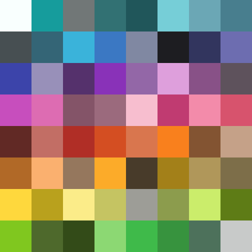

# Vanilla Palette Color Mix Projections



This project generates, reduces, and analyzes a color palette derived from a small set of user-defined base colors.
It simulates 50/50 color mixing, trims the palette to a fixed size using perceptual distance, and projects all possible mixes onto the closest remaining palette colors.

The final result is exported as a rich Markdown document with color previews, detailed metadata, and mix projection statistics.

## What this project does

- Loads a set of base colors from a YAML file
- Generates all valid pairwise color mixes using `mixbox`
- Reduces the palette to a fixed maximum size using a perceptual farthest-point algorithm (CIEDE2000)
- Ensures all user-defined colors are always preserved
- Projects every possible base-color mix onto the closest palette color
- Resolves human-readable color names via a single batched request to **color.pizza**
- Generates 64×64 color preview icons
- Exports everything into a structured Markdown document

The output is designed to be both human-readable and machine-friendly.

## Directory structure

```
📁 PaletteVanilla
├── main.py
└── resources
    ├── input.yml
    ├── output.md
    └── icons
        ├── red.png
        ├── blue.png
        └── ...
```

## Input format (input.yml)

Colors are defined under a single `colors` key.

Each color supports:
- hex – hexadecimal color value
- gen – generation index (0 = base color)
- mixed_from – optional list of parent colors

Example:

colors:
  red:
    hex: "#B02E26"
    gen: 0

  purple:
    hex: "#8932B8"
    gen: 1
    mixed_from: ["red", "blue"]

Notes:
- Colors with gen: 0 are treated as immutable base colors
- All parsed colors are guaranteed to remain in the final palette
- mixed_from is used to preserve known canonical mixes

## Palette generation

After loading the input:
1. All unordered pairs of base colors are mixed using mixbox
2. Explicitly defined mixes in input.yml are not duplicated
3. Each generated mix becomes a candidate palette color
4. Every color stores its generation depth (gen)

## Palette reduction algorithm

The palette is reduced to a user-specified maximum size using farthest-point sampling in CIELAB space.

Properties:
- Uses CIEDE2000 (ΔE) for perceptual accuracy
- All user-defined colors are always kept
- Remaining colors are selected to maximize perceptual coverage
- Reduction stops once the requested palette size is reached

## Mix projection

Once the final palette is selected:
- Every unordered pair of base colors is virtually mixed (50/50)
- The result is projected onto the closest existing palette color
- Distance is measured using CIEDE2000
- Canonical mixes resolve with ΔE = 0

## Color name resolution

All color names are resolved in one single API call to color.pizza.
- Uses the bestOf list
- Avoids duplicates where possible
- Preserves existing names
- Falls back gracefully on failure

## Output (output.md)

The generated Markdown file contains:
- Summary statistics
- Colors grouped by generation
- Inline preview icons
- Hex, RGB, and Lab values
- Parent mix information
- JavaScript-style projection listings with ΔE values

## Running the project

This project is designed to run with uv.

```bash
uv sync
uv run python main.py --size 16
```

Arguments:
- `--size`: Maximum number of colors allowed in the final palette

## Dependencies

- pyyaml
- mixbox
- colour-science
- numpy
- Pillow
- requests

## Design notes

- Single-file project
- Functional pipeline
- Strong typing
- Deterministic output
